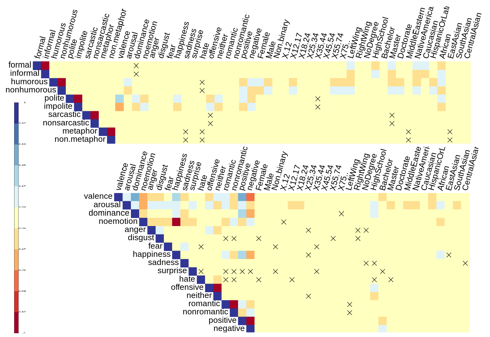

# xSLUE
Data and code for our ACL 2021 paper ["Style is NOT a single variable: Case Studies for Cross-Style Language Understanding
"](https://arxiv.org/abs/1911.03663) by Dongyeop Kang and Eduard Hovy. Please find our project page ([http://xslue.com/](http://xslue.com/)) which includes dataset, examples, classifiers, and leaderboard. If you have any questions, please contact to Dongyeop Kang (dongyeopk@berkeley.edu).

We provide an online platform for cross-style language understanding and evaluation.
The [Cross-Style Language Understanding and Evaluation (xSLUE) benchmark](https://xslue.com/) contains 15 different styles and 23 classification tasks. For each task, we also provide the fine-tuned BERT classifier for further analysis. Our analysis shows that some styles are highly dependent on each other (e.g., impoliteness and offense), and some domains (e.g., tweets, political debates) are stylistically more diverse than the others (e.g., academic manuscripts).




## Citation
    @inproceedings{kang2021xslue,
        title = "Style is NOT a single variable: Case Studies for Cross-Style Language Understanding",
        author = "Kang, Dongyeop  and
          Hovy, Eduard",
        booktitle = "Proceedings of the 59th Annual Meeting of the Association for Computational Linguistics",
        year = "2021",
        publisher = "Association for Computational Linguistics",
    }    

### Notes
- Please contact to Dongyeop (dongyeok@cs.cmu.edu) if you like to add your cross-style system to the leaderboard or evaluate your system on the diagnostic cross-set.
- For the license issue, we did not include GYAFC in the benchmark but include only the fine-tuned classifier. You can directly contact to the authors, and then use our [pre-processing script](https://github.com/dykang/xslue/code/prepare/preprocess/convert_gyafc_to_slue.py).

### Download xSLUE data and fine-tuned classifiers
Before running any xSLUE tasks you should download the
[xSLUE data](https://xslue.com/task) by running this [script](https://github.com/dykang/xslue/code/download_xslue_data.sh). You can also download the fine-tuned BERT classifiers by running this [script](https://github.com/dykang/xslue/code/download_xslue_model.sh). We also provide the links to download individual dataset and model files in the table at the bottom of this page below. 


### `run_xslue.sh`: Fine-tuning on xSLUE tasks for style classification
You need to unpack the downloaded data to some directory `$XSLUE_DIR`. An example python script for loading each dataset is provided here
```shell
cd code/style_classify/
./run_xslue.sh
```

or

```shell
XSLUE_DIR=$HOME/data/xslue
XSLUE_MODEL_DIR=$HOME/data/xslue_model

TASK_NAMES=("SentiTreeBank" "EmoBank_v"  "EmoBank_a" "EmoBank_d" "SARC" "SARC_pol" "StanfordPoliteness" "GYAFC"  "DailyDialog" "SarcasmGhosh" "ShortRomance" "CrowdFlower" "VUA" "TroFi" "ShortHumor" "ShortJokeKaggle" "HateOffensive" "PASTEL_politics" "PASTEL_country" "PASTEL_tod" "PASTEL_age" "PASTEL_education" "PASTEL_ethnic" "PASTEL_gender")

MODEL=bert-base-uncased

for TASK_NAME in "${TASK_NAMES[@]}"
do
    echo "Running ... ${TASK_NAME}"
    CUDA_VISIBLE_DEVICES=0 \
    python classify_bert.py \
        --model_type bert \
        --model_name_or_path ${MODEL} \
        --task_name ${TASK_NAME} \
        --do_eval --do_train \
        --do_lower_case \
        --data_dir ${XSLUE_DIR}/${TASK_NAME} \
        --max_seq_length 128 \
        --per_gpu_eval_batch_size=8   \
        --per_gpu_train_batch_size=8   \
        --learning_rate 2e-5 \
        --num_train_epochs 3 \
        --output_dir ${XSLUE_MODEL_DIR}/${TASK_NAME}/${MODEL}/ \
        --overwrite_output_dir --overwrite_cache
done
```


### Dependencies
We used python 3.7. You should also install the additional packages required by the examples:

```shell
pip install -r ./requirements.txt
```

### xSLUE Data and Classifiers
Please check more details in [xslue.com/task](http://xslue.com/task).

| Style | Name |  Dataset | Classifier | Original |
| :---: | :---: | :---: | :---: | :---: |
| Formality | GYAFC | Not public  | [download](http://dongtae.lti.cs.cmu.edu/data/xslue_model_v0.1/GYAFC.zip) | [link](https://github.com/raosudha89/GYAFC-corpus) |
| Politeness | StanfordPoliteness | [download](http://dongtae.lti.cs.cmu.edu/data/xslue_v0.1/StanfordPoliteness.zip) | [download](http://dongtae.lti.cs.cmu.edu/data/xslue_model_v0.1/StanfordPoliteness.zip) | [link](https://www.cs.cornell.edu/~cristian/Politeness.html) |
|  Humor |  ShortHumor | [download](http://dongtae.lti.cs.cmu.edu/data/xslue_v0.1/ShortHumor.zip) | [download](http://dongtae.lti.cs.cmu.edu/data/xslue_model_v0.1/ShortHumor.zip) | [link](http://dongtae.lti.cs.cmu.edu:2828/github.com/CrowdTruth/Short-Text-Corpus-For-Humor-Detection) |
|  Humor |  ShortJokeKaggle | [download](http://dongtae.lti.cs.cmu.edu/data/xslue_v0.1/ShortJokeKaggle.zip) | [download](http://dongtae.lti.cs.cmu.edu/data/xslue_model_v0.1/ShortJokeKaggle.zip) | [link](https://github.com/amoudgl/short-jokes-dataset) |
|  Sarcasm | SarcasmGhosh  | [download](http://dongtae.lti.cs.cmu.edu/data/xslue_v0.1/SarcasmGhosh.zip) | [download](http://dongtae.lti.cs.cmu.edu/data/xslue_model_v0.1/SarcasmGhosh.zip) | [link](https://github.com/AniSkywalker/SarcasmDetection) |
| Sarcasm  |  SARC | [download](http://dongtae.lti.cs.cmu.edu/data/xslue_v0.1/SARC.zip) | [download](http://dongtae.lti.cs.cmu.edu/data/xslue_model_v0.1/SARC.zip) | [link](https://github.com/NLPrinceton/SARC) |
| Metaphor  |  VUA | [download](http://dongtae.lti.cs.cmu.edu/data/xslue_v0.1/VUA.zip) | [download](http://dongtae.lti.cs.cmu.edu/data/xslue_model_v0.1/VUA.zip) | [link](http://www.vismet.org/metcor/documentation/home.html) |
|  Metaphor | TroFi  | [download](http://dongtae.lti.cs.cmu.edu/data/xslue_v0.1/TroFi.zip) | [download](http://dongtae.lti.cs.cmu.edu/data/xslue_model_v0.1/TroFi.zip) | [link](http://natlang.cs.sfu.ca/software/trofi.html) |
|  Emotion |  EmoBank | [download](http://dongtae.lti.cs.cmu.edu/data/xslue_v0.1/EmoBank.zip) | [download](http://dongtae.lti.cs.cmu.edu/data/xslue_model_v0.1/EmoBank.zip) | [link](https://github.com/JULIELab/EmoBank) |
|  Emotion |  CrowdFlower | [download](http://dongtae.lti.cs.cmu.edu/data/xslue_v0.1/CrowdFlower.zip) | [download](http://dongtae.lti.cs.cmu.edu/data/xslue_model_v0.1/CrowdFlower.zip) | [link](https://data.world/crowdflower/sentiment-analysis-in-text) |
|  Emotion |  DailyDialog | [download](http://dongtae.lti.cs.cmu.edu/data/xslue_v0.1/DailyDialog.zip) | [download](http://dongtae.lti.cs.cmu.edu/data/xslue_model_v0.1/DailyDialog.zip) | [link](http://yanran.li/dailydialog.html) |
| Offense |  HateOffensive | [download](http://dongtae.lti.cs.cmu.edu/data/xslue_v0.1/HateOffensive.zip) | [download](http://dongtae.lti.cs.cmu.edu/data/xslue_model_v0.1/HateOffensive.zip) | [link](https://github.com/t-davidson/hate-speech-and-offensive-language) |
| Romance  | ShortRomance  | [download](http://dongtae.lti.cs.cmu.edu/data/xslue_v0.1/ShortRomance.zip) | [download](http://dongtae.lti.cs.cmu.edu/data/xslue_model_v0.1/ShortRomance.zip) | [link](https://github.com/dykang/xslue) |
| Sentiment  |  SentiTreeBank | [download](http://dongtae.lti.cs.cmu.edu/data/xslue_v0.1/SentiTreeBank.zip) | [download](http://dongtae.lti.cs.cmu.edu/data/xslue_model_v0.1/SentiTreeBank.zip) | [link](https://nlp.stanford.edu/sentiment/treebank.html) |
| Persona  |  PASTEL | [download](http://dongtae.lti.cs.cmu.edu/data/xslue_v0.1/PASTEL.zip) | [download](http://dongtae.lti.cs.cmu.edu/data/xslue_model_v0.1/PASTEL.zip) | [link](https://github.com/dykang/PASTEL) |


### Acknolwedgements
 - our style classification code is based on huggingface's [transformers](https://github.com/huggingface/transformers) on GLUE tasks.
 - our BiLSTM baseline code is based on [Pytorch-RNN-text-classification](https://github.com/keishinkickback/Pytorch-RNN-text-classification).


